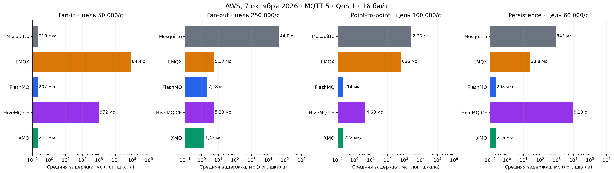
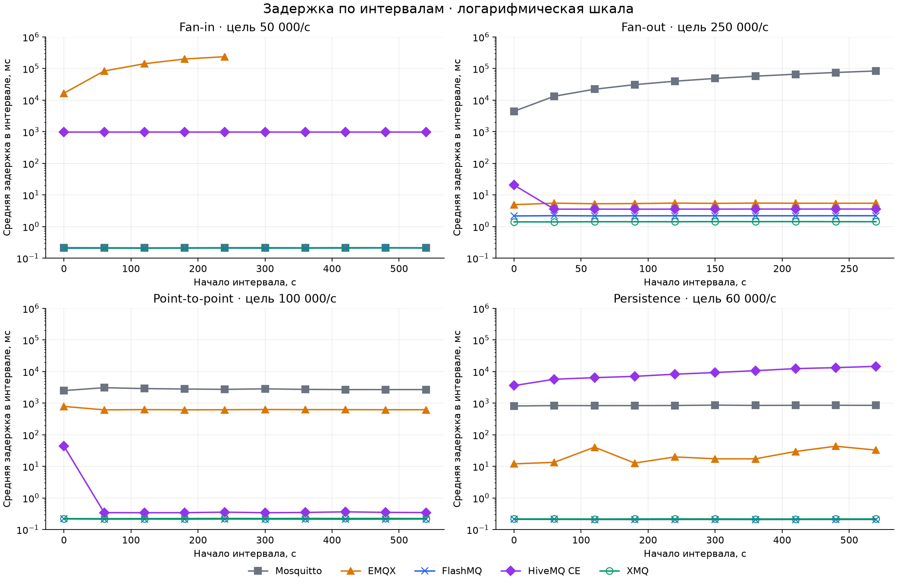

# Пять MQTT-брокеров на AWS: задержка, CPU и память под одинаковой нагрузкой

Сколько сообщений в секунду выдерживает MQTT-брокер? Без описания нагрузки вопрос ничего не значит: приём от 50 тысяч устройств, рассылка одного сообщения тысяче подписчиков и полмиллиона соединений нагружают сервер по-разному.

Я прогнал Mosquitto, EMQX, FlashMQ, HiveMQ CE и XMQ через пять одинаковых сценариев на одной паре машин AWS. Для каждого брокера записаны задержка, CPU и память по минутным интервалам — в том числе там, где брокер не справился.

Сразу о заинтересованности: я разработчик XMQ, и генератор нагрузки `xmq_scn` — тоже из этого проекта. Поэтому все версии, конфигурации и полные отчёты открыты: результат можно проверить и повторить.

## Коротко

Средняя задержка по сценариям; † — брокер не держал заданную скорость.

| Брокер | Соединения | Fan-in | Fan-out | Point-to-point | Persistence |
|---|---:|---:|---:|---:|---:|
| Mosquitto 2.1.2 | 1,0 мс | 210 мкс | 44 с † | 2,76 с | 843 мс |
| EMQX 6.3.1 | 720 мкс | 84 с † | 5,4 мс | 636 мс | 23,8 мс |
| FlashMQ 1.27.2 | 347 мкс | 207 мкс | 2,2 мс | 214 мкс | 208 мкс |
| HiveMQ CE 2026.5 | 4,1 мс | 972 мс | 5,2 мс | 4,7 мс | 9,1 с |
| XMQ 0.9.20 | 340 мкс | 211 мкс | 1,4 мс | 222 мкс | 216 мкс |

FlashMQ и XMQ прошли все сценарии с субмиллисекундной задержкой (fan-out — около 2 мс). Mosquitto сильнее всех там, где хватает одного ядра. EMQX и HiveMQ CE держат большинство нагрузок, но платят за это задержкой и ресурсами.

## Сценарии

За основу взят [Open MQTT Benchmark Suite](https://github.com/emqx/mqttbs) команды EMQX и их [сравнение EMQX и Mosquitto](https://www.emqx.com/en/blog/open-mqtt-benchmarking-comparison-emqx-vs-mosquitto) (апрель 2023): fan-in, fan-out, point-to-point и соединения, параметры Enterprise Set. Похожие типы нагрузки использует и [HiveMQ](https://www.hivemq.com/blog/cracking-mqtt-performance-automation-part-2-benchmarking/).

Отличия от исходной статьи:

- все сценарии на MQTT 5, по 10 минут (fan-out — 5) вместо 30;
- point-to-point — 100 тысяч сообщений/с вместо 50 тысяч;
- соединений 500 тысяч вместо миллиона, со скоростью 5000/с;
- добавлен сценарий с persistent sessions;
- сервер c5n.4xlarge вместо c5.4xlarge, генератор `xmq_scn` вместо XMeter.

Это применение тех же сценариев, а не повторение эксперимента 2023 года. Численные результаты оттуда не используются.

## Стенд

Брокер и генератор — на отдельных EC2 c5n.4xlarge (16 vCPU: 8 ядер × 2 потока) в одной placement group, Ubuntu 26.04, ядро 7.0.0-1013-aws, без привязки к CPU. Перед каждым сценарием брокер перезапускался, остальные были остановлены. Сообщения: QoS 1, payload 16 байт.

Брокеры настроены под большую нагрузку, а не взяты с настройками по умолчанию:

- **Mosquitto:** `max_queued_messages 0`, `max_inflight_messages 65534`. Значение 0 в Mosquitto 2.1 оставляет входную квоту нулевой, и брокер пишет предупреждение на каждое сообщение — такой прогон заполнил диск сервера и был повторён.
- **EMQX:** `force_shutdown.max_mailbox_size` и `max_mqueue_len` подняты до 100000 (по умолчанию 1000: подписчики отключались, сообщения отбрасывались), `max_inflight 128`.
- **FlashMQ:** 16 рабочих потоков.
- **HiveMQ CE:** JVM `-Xms2g -Xmx20g -XX:MaxDirectMemorySize=5g`.
- **XMQ:** 3 send-, 4 receive- и 2 delivery-потока.

Подробнее о стенде — [на сайте XMQ](https://xmq.sptk.net/xmq_tests_environment), там же интерактивные графики этой серии.

## Как читать числа

- **Задержка** — от вызова публикации до получения подписчиком. В таблицах — среднее за весь прогон, включая старт; на графиках — среднее внутри каждого интервала. Перцентилей отчёты не содержат.
- **CPU** — в процентах одного аппаратного потока: 400% — четыре занятых vCPU из 16.
- **Память** — пик RSS процесса брокера.
- Генератор сопоставляет получения с отправками по порядку (FIFO), а не по идентификатору сообщения. Пока доставка идёт без потерь, это точно; когда брокер теряет сообщения, оценка задержки завышается. Это важно для EMQX в fan-in.

## 500 тысяч соединений

500000 клиентов подключаются со скоростью 5000/с; задержка — время подключения.

| Брокер | Среднее | Медиана интервалов | CPU, среднее | Пик RSS |
|---|---:|---:|---:|---:|
| Mosquitto | 1004 мкс | 316 мкс | 18% | 2,41 GB |
| EMQX | 720 мкс | 712 мкс | 359% | 10,06 GB |
| FlashMQ | 347 мкс | 327 мкс | 33% | 2,13 GB |
| HiveMQ CE | 4088 мкс | 3477 мкс | 107% | 4,06 GB |
| XMQ | 340 мкс | 338 мкс | 52% | 1,27 GB |

Все пять брокеров приняли все соединения. Mosquitto, FlashMQ и XMQ подключают клиента за ~0,3 мс; среднее Mosquitto испортил один интервал в 7,2 мс. Меньше всех CPU тратит однопоточный Mosquitto, меньше всех памяти — XMQ.

## Fan-in: 50 тысяч издателей, одна общая подписка

50000 издателей шлют по сообщению в секунду, каждый в свой topic. 500 подписчиков делят поток через `$share/benchmark/test/#`. Цель — 50000 доставок/с.

| Брокер | Доставок/с | Средняя задержка | CPU, среднее | Пик RSS |
|---|---:|---:|---:|---:|
| Mosquitto | 49992 | 210 мкс | 88% | 258 MB |
| EMQX | 1613 † | 84 с | 965% | 12,85 GB |
| FlashMQ | 49992 | 207 мкс | 221% | 246 MB |
| HiveMQ CE | 49908 | 972 мс | 185% | 1,91 GB |
| XMQ | 49992 | 211 мкс | 228% | 192 MB |

Mosquitto, FlashMQ и XMQ неразличимы по задержке: 50 тысяч сообщений в секунду для них — небольшая нагрузка. Mosquitto тратит меньше CPU, XMQ — меньше памяти.

HiveMQ CE держит скорость, но задержка всё время около секунды — похоже на буферизацию в общей подписке; причину этот тест не устанавливает.

EMQX упирается в CPU: 16 ядер, доставка 1–3,5 тысячи сообщений в секунду из 50. Очереди подписчиков растут, пока их процессы не превышают `force_shutdown.max_heap_size` (48 МБ) — тогда EMQX закрывает подписчиков вместе с очередями. Примерно через 5 минут доставка прекращается: из 30 миллионов отправленных сообщений получено 484 тысячи. Поднять лимит кучи можно, но скорость доставки это не изменит — задержка продолжила бы расти.

## Fan-out: одно сообщение — тысяче подписчиков

5 издателей шлют по 50 сообщений/с в 5 topics, 1000 подписчиков получают всё: 250 публикаций превращаются в 250000 доставок/с. 5 минут, 1005 соединений.

| Брокер | Доставок/с | Средняя задержка | CPU, среднее | Пик RSS |
|---|---:|---:|---:|---:|
| Mosquitto | 176577 † | 44 с | 100% | 73 MB |
| EMQX | 249972 | 5,4 мс | 1491% | 617 MB |
| FlashMQ | 249993 | 2,2 мс | 567% | 28 MB |
| HiveMQ CE | 249890 | 5,2 мс | 1068% | 1,58 GB |
| XMQ | 249993 | 1,4 мс | 376% | 45 MB |

Здесь XMQ быстрее всех и тратит меньше всех CPU среди брокеров, державших скорость; FlashMQ — самый экономный по памяти. Mosquitto упирается в одно ядро: 177 тысяч доставок/с, и задержка за 5 минут растёт от 4 до 84 секунд. У HiveMQ CE медленный только первый интервал (20 мс), дальше около 3,5 мс.

## Point-to-point: 100 тысяч сообщений в секунду

50000 пар издатель–подписчик, у каждой свой topic, по 2 сообщения в секунду: 100000 соединений и 100000 доставок/с.

| Брокер | Доставок/с | Средняя задержка | CPU, среднее | Пик RSS |
|---|---:|---:|---:|---:|
| Mosquitto | 99449 | 2,76 с | 97% | 615 MB |
| EMQX | 99700 | 636 мс | 1503% | 4,93 GB |
| FlashMQ | 99915 | 214 мкс | 448% | 493 MB |
| HiveMQ CE | 99862 | 4,7 мс | 1046% | 2,83 GB |
| XMQ | 99913 | 222 мкс | 429% | 387 MB |

Скорость держат все, задержку — нет. FlashMQ и XMQ — около 0,2 мс. HiveMQ CE после первой минуты (44 мс) работает на 340–363 мкс — вероятно, прогрев JVM. EMQX держит 0,6 с на 15 ядрах, Mosquitto — 2,7 с на одном.

Интерактивные версии этих графиков, вместе с памятью брокеров по интервалам, — [на сайте XMQ](https://xmq.sptk.net/xmq_tests_fanin).

## Persistence: 60 тысяч сообщений в секунду с persistent sessions

60000 пар с `clean_session=false`, по сообщению в секунду, 10 минут. Хранилище перед прогоном очищено. Брокеры сохраняют состояние по-разному, поэтому способ указан в таблице:

| Брокер | Как хранит | Доставок/с | Средняя задержка | CPU, среднее | Пик RSS |
|---|---|---:|---:|---:|---:|
| Mosquitto | снимок по `autosave_interval` | 59844 | 843 мс | 97% | 642 MB |
| EMQX | durable sessions | 59655 | 23,8 мс | 1265% | 5,08 GB |
| FlashMQ | снимок в `storage_dir` | 59941 | 208 мкс | 246% | 587 MB |
| HiveMQ CE | файловая persistence | 58368 | 9,1 с | 1398% | 22,09 GB |
| XMQ | Redis (AOF, `appendfsync everysec`) | 59933 | 216 мкс | 284% | 460 MB |

Mosquitto и FlashMQ периодически сохраняют снимок; EMQX, HiveMQ CE и XMQ записывают сообщения. Поэтому одинаковая задержка FlashMQ и XMQ не означает одинаковых гарантий: при сбое FlashMQ теряет всё после последнего снимка. XMQ при падении процесса теряет не больше сообщений, чем ждут записи в Redis: их число ограничено `max_queued_writes` (здесь 1000; при 60000 сообщений/с это около 17 мс потока). При отказе всего хоста добавляется окно `appendfsync everysec` самого Redis — до секунды. Redis работал на том же хосте; его CPU и память в таблицу не входят.

HiveMQ CE не успевает: задержка растёт от 3,6 до 14,6 с, память — до 22 GB. EMQX держит скорость с задержкой 12–43 мс по интервалам.

Первый прогон EMQX не принял ни одного persistent-подключения (`Server not available`). Виноват был наш скрипт очистки: он удалял данные durable storage, но оставлял Mnesia, где они записаны, и EMQX ждал несуществующих реплик. После исправления сценарий повторён на AWS с теми же настройками; в таблице — повторный прогон.

## Чего этот тест не показывает

Это один прогон каждой пары «брокер — сценарий», без повторов и доверительных интервалов: разницу в несколько микросекунд между FlashMQ, Mosquitto и XMQ не стоит считать рейтингом. Тест не ищет предел пропускной способности — только поведение при заданной нагрузке. Не сравниваются кластеры, TLS, большие сообщения, восстановление после сбоя и удобство эксплуатации.

## Как повторить

Сценарии, генератор, конфигурации брокеров и полные отчёты этой серии — в [репозитории XMQ](https://github.com/alexparshin1/xmq_public) (`LoadTest/`), описание генератора — на [странице MQTT Test Suite](https://xmq.sptk.net/xmq_mqtt_test_suite):

- `500K-Connections-5000-rate.json` — 500000 подключений, 5000/с;
- `Fan-In-50K-500-50K-50K.json` — 50000 издателей, 500 участников общей подписки, 50000 сообщений/с;
- `Fan-Out-5-1000-5-250K-5min.json` — 5 издателей, 1000 подписчиков, 250000 доставок/с;
- `Point-To-Point-50K-50K-50K-100K.json` — 50000 пар, 100000 сообщений/с;
- `Point-To-Point-60K-persistent.json` — 60000 пар с persistent sessions.

Если прогоните их на своём железе или найдёте ошибку в методике — пишите в [issues](https://github.com/alexparshin1/xmq_public/issues). XMQ можно [скачать](https://xmq.sptk.net/downloads) или запустить в Docker (см. README).
